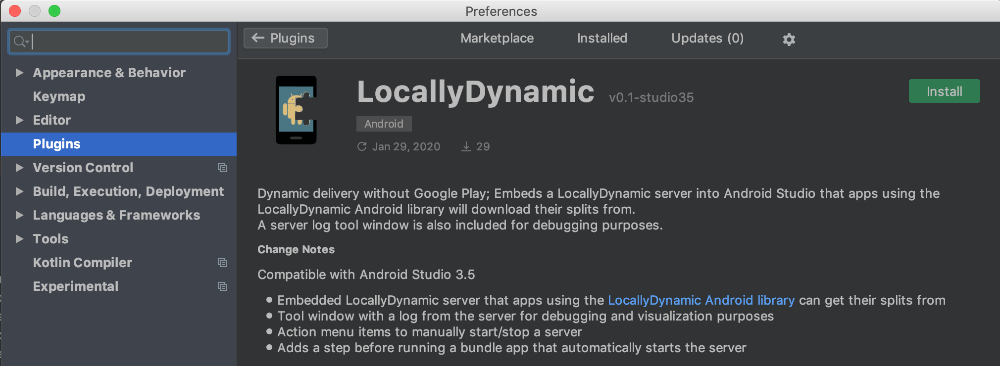

# locallydynamic-studio-plugin
An Android Studio plugin that embeds a <a href="../locallydynamic-server-library">LocallyDynamic server</a> that apps can download
split APK:s from during development.

Usage
---
Download it from <a href="https://plugins.jetbrains.com/plugin/13645-locallydynamic">here</a>, in Android Studio search for
"LocallyDynamic" in plugins and you should see:

    

